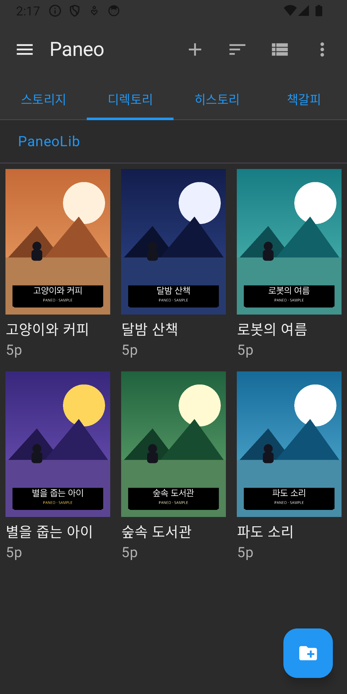
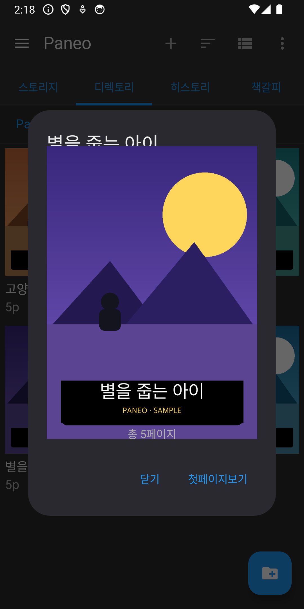
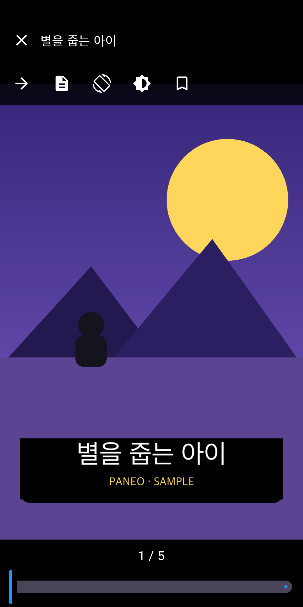
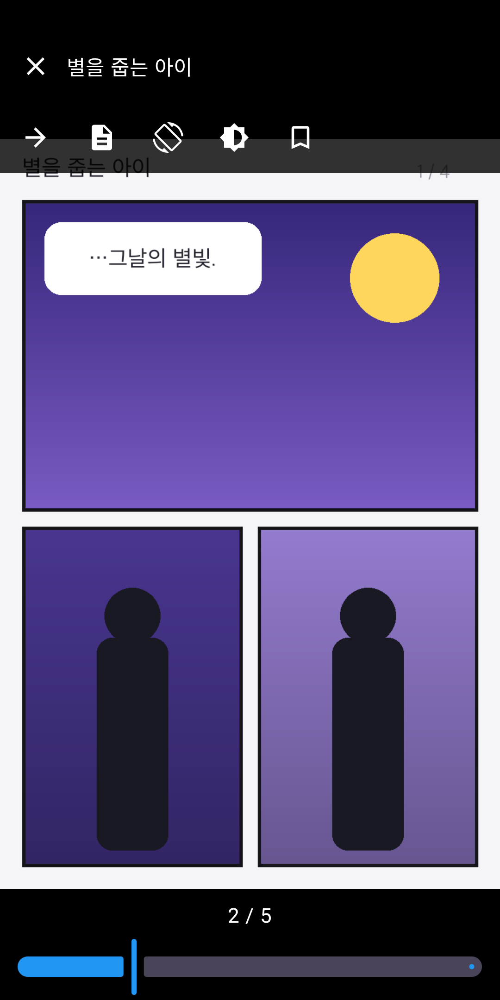

# Paneo

광고 없는 **로컬 만화 뷰어** (Android). 기기에 있는 만화 파일을
Storage Access Framework 로 읽어 쾌적하게 보는 것이 목표입니다.
이미지 폴더는 물론 **ZIP/CBZ · CBR · PDF** 를 압축 해제 없이 바로 읽습니다.

> 패키지: `com.jhyun.comicviewer` · 버전: `0.1.0` · minSdk 26 / target 35

> **English summary** — Paneo is an ad-free, offline comic/manga reader for Android.
> It reads image folders and **ZIP/CBZ, CBR, and PDF** archives *without extracting them*,
> using the Storage Access Framework so it needs **no storage permissions**.
> Features a Perfect Viewer–style library (storage / directory / history / bookmark tabs),
> a full reader (6 reading directions, tap zones, volume-key paging, brightness panel,
> thumbnail filmstrip), resume-reading, bookmarks, and DataStore-backed settings.
> Built with **Kotlin · Jetpack Compose · Hilt · Room · Coil** (custom archive fetchers),
> with unit + instrumented tests and a GitHub Actions CI pipeline.
> The project was built end-to-end with AI pair-programming (Claude Code) as a portfolio piece.

## 스크린샷 / Screenshots

| 라이브러리 (디렉토리) | 폴더 미리보기 | 리더 — 표지 | 리더 — 페이지/툴바 |
| :---: | :---: | :---: | :---: |
|  |  |  |  |
| 탭 + 그리드 표지 | 표지 미리보기 다이얼로그 | 오버레이 + 페이지 슬라이더 | 읽기 툴바 + 다중 컷 |

<sub>스크린샷의 표지/페이지는 모두 자체 제작 샘플 데이터(PANEO · SAMPLE)입니다.</sub>

## 주요 기능
- **라이브러리**: 상단 탭(스토리지 / 디렉토리 / 히스토리 / 책갈피), 그리드·리스트 전환, 이름·날짜 정렬
- **폴더 추가**: SAF 영구 권한으로 폴더 등록 → Room 에 저장되어 재실행 후에도 유지
- **폴더 미리보기**: 이미지가 있는 폴더를 누르면 표지 미리보기 다이얼로그
- **아카이브 직접 읽기**: ZIP/CBZ(commons-compress 랜덤 액세스), CBR(junrar · RAR4), PDF(PdfRenderer)
  - Coil 커스텀 Fetcher/Keyer 로 아카이브 내부 엔트리를 페이지로 디코딩
  - 열린 아카이브 LRU 캐시(`ArchivePageCache`)로 대용량 zip 페이지 로딩 개선
- **리더**: 탭 토글 오버레이, 읽기 방향 6종(좌/우·세로·부드러운 스크롤), 페이지 레이아웃 4종,
  밝기·배경색·화면 켜둠 패널, 회전 잠금, 좌/우 탭존, 볼륨키 페이지 넘김, 페이지 썸네일 필름스트립
- **이어보기**: 마지막 페이지 저장 → 히스토리 탭에서 이어 읽기
- **책갈피**: 페이지 단위 책갈피 추가/이동/삭제
- **설정 화면**: 기본 읽기 방향·레이아웃, 볼륨키 넘김 토글, 버전 정보 (DataStore 영속화)
- **삭제 안전장치**: 폴더 제거 확인(실제 파일은 보존), 히스토리/책갈피 개별 삭제

## 기술 스택
- Kotlin / Jetpack Compose / Material3
- Hilt (DI), Room (DB), Preferences DataStore (설정 영속화)
- Coil 2.7 (이미지) + 커스텀 Fetcher, Telephoto 0.13 (줌)
- Apache Commons Compress (zip 랜덤 액세스), junrar 7.5.5 (rar4), PdfRenderer (pdf)
- Storage Access Framework — 저장소 권한 불필요(`MANAGE_EXTERNAL_STORAGE` 미사용)

## 빌드 / 실행
```bash
./gradlew assembleDebug          # 디버그 APK 빌드
./gradlew installDebug           # 연결된 기기에 설치
./gradlew bundleRelease          # 서명된 릴리스 AAB (Play 업로드용)
```
Android Studio 에서 이 폴더를 열어도 됩니다.

## 테스트 / 검사
```bash
./gradlew ktlintCheck            # 코드 스타일 검사
./gradlew ktlintFormat           # 자동 정렬 (ktlintCheck 와 따로 실행 권장)
./gradlew testDebugUnitTest      # JVM 단위 테스트 (Robolectric 포함)
./gradlew connectedDebugAndroidTest   # 계측 테스트 (에뮬레이터/기기 필요)
```
- **단위 테스트**: 자연정렬, ViewModel, 읽기 방향 enum 등 (`app/src/test`)
- **계측 테스트**: Room DAO(진행도/책갈피/폴더), Compose UI (`app/src/androidTest`)
- Repository/SettingsStore 는 인터페이스 + Fake 구현으로 테스트 가능하게 설계

## CI (GitHub Actions)
`main` push / PR 시 `.github/workflows/ci.yml` 실행:
- **build 잡**: `ktlintCheck` → `testDebugUnitTest` → `assembleDebug` → APK 아티팩트 업로드
- **instrumented 잡**: KVM 가속 에뮬레이터(API 34)에서 `connectedDebugAndroidTest`
- 배포(CD)는 미설정 — Play 콘솔 최초 출시 이후 추가 예정

## Git 훅 (ktlint)
코드 스타일을 자동 강제하기 위해 git 훅을 사용합니다. **클론 후 한 번만** 설치하세요:
```bash
./gradlew installGitHooks
```
- **pre-commit**: 스테이징된 Kotlin 파일에 `ktlintFormat` 자동 적용 후 재-stage
- **pre-push**: `ktlintCheck` + 단위 테스트. 실패 시 푸시 차단
- 긴급 우회: `git commit/push --no-verify`
- 규칙은 `.editorconfig` 에서 조정 (Compose 친화 설정 포함).

> 부분 커밋 시 주의: pre-commit 훅이 비스테이징 변경을 되돌렸다 재적용하므로
> 의도치 않은 파일이 섞일 수 있습니다. 한 그룹씩 커밋하고 `git diff --cached --name-only` 로
> 확인하거나, 부분 커밋은 `--no-verify` 를 사용하세요.

## 릴리스 서명
릴리스 빌드는 `keystore.properties`(git 제외)의 정보로 서명합니다. **클론 후 본인 키스토어로 한 번 설정**하세요:
```bash
# 1) 업로드 키스토어 생성 (한 번만)
keytool -genkeypair -v -keystore app/upload-keystore.jks \
  -alias upload -keyalg RSA -keysize 2048 -validity 10000
# 2) 프로젝트 루트에 keystore.properties 작성 (git 제외됨)
cat > keystore.properties <<'PROP'
storeFile=upload-keystore.jks
storePassword=<스토어 비밀번호>
keyAlias=upload
keyPassword=<키 비밀번호>
PROP
```
- `keystore.properties` / `*.jks` 는 **절대 커밋 금지**(`.gitignore` 처리됨).
- 파일이 없으면 릴리스 빌드는 **디버그 서명으로 폴백**(설치 테스트용, Play 업로드 불가).
- Play **App Signing** 사용 권장: 이 키는 "업로드 키"로만 쓰고 앱 서명 키는 Google 이 관리.

## 환경 메모
- compileSdk / targetSdk = 35 (Play 신규 앱/업데이트 요건)
- minSdk = 26
- applicationId = `com.jhyun.comicviewer`
- 릴리스: R8 minify + 리소스 축소 활성화 (proguard-rules.pro)
- cbr 은 junrar 한계로 **RAR4 만 지원**(RAR5 미지원)

## 다음 단계 (로드맵)
- 더블 페이지(견본) 레이아웃 완성도 및 자동 모드 다듬기
- 표지 썸네일 캐시 및 라이브러리 로딩 인디케이터
- 미지원 아카이브 배지 / 빈 폴더 안내 등 UX 폴리시
- 몰입형(풀스크린) 리더 모드
- 출시 준비: AAB, 개인정보처리방침, Data safety, 내부→비공개→프로덕션 트랙

## 코드 구조
```
app/src/main/java/com/jhyun/comicviewer/
 ├─ core/        # 공통 유틸 (NaturalOrderComparator 등)
 ├─ data/        # SafScanner, LibraryRepository, SettingsStore, SortOrder,
 │               # ArchivePageCache, ZipEntryFetcher/RarEntryFetcher/PdfPageFetcher,
 │               # local/ (Room: AppDatabase + Source/Progress/Bookmark DAO·Entity)
 ├─ di/          # Hilt 모듈 (DatabaseModule, RepositoryModule)
 └─ ui/
     ├─ library/ # LibraryScreen, LibraryViewModel, ReaderScreen, SettingsScreen
     └─ theme/
```

## Claude Code 스킬
`.claude/skills/` 에 프로젝트 운영용 스킬이 있습니다:
`device-run`(빌드·설치·캡처), `run-checks`(린트·테스트), `ci-status`(CI 확인),
`seed-test-comics`(테스트 데이터), `release-checklist`(출시 체크리스트).
